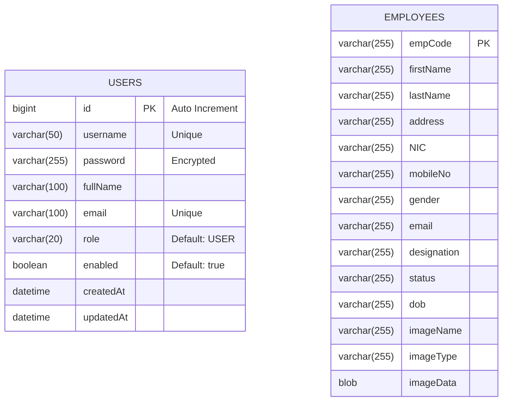

# Entity Relationship Diagram

This document illustrates the database schema for the Employee Management System.

## Diagram

## Entity Details

### 1. USERS Table

Stores system administrator and user credentials for application access.

- **id**: Primary Key, unique identifier.
- **username**: Unique login identifier.
- **password**: Hashed password for security.
- **role**: Determines access level (e.g., ADMIN, USER).

### 2. EMPLOYEES Table

Stores the core HR data for the organization.

- **empCode**: Primary Key, unique employee identifier (e.g., EMP001).
- **NIC**: National Identity Card number.
- **imageData**: Stores the employee's profile picture as a BLOB (Binary Large Object).
